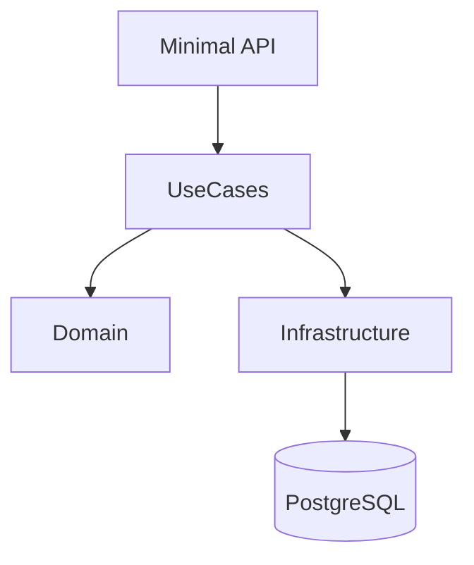

# Design: Core Minimal API

## Service Architecture
We will implement a modular Minimal API structure using .NET 8, following the existing Clean Architecture principles defined in `project.md`.

### Component Diagram

### API Structure
- **Endpoints**: Defined in `src/Presentation/Endpoints` (or `src/API/Endpoints` if creating a new project).
- **Versioning**: API Versioning will be prepared but simple V1 for now.
- **Validation**: Input validation using `FluentValidation` (or native if preferred, but existing project uses `Result` pattern which works well here).

### Data Flow
1. **Request**: Incoming HTTP Request.
2. **Endpoint**: Map request to UseCase Input.
3. **UseCase**: Execute business logic (Application Layer).
4. **Domain**: Enforce business rules.
5. **Infrastructure**: Persist data.
6. **Response**: Map UseCase Result to HTTP Response (200 OK, 400 Bad Request, etc.).

## Open Questions / Trade-offs
- **"Serviços de conta corrente"**: This is broad. For this minimal API, I will interpret it as:
    - Get Balance (Explicitly requested).
    - Get Account Details.
    - (Future) Transfer/Deposit/Withdraw - Not explicitly detailed in the request "Create ... for: ... services ... check balance". "Check balance" is specific, "Account services" is generic. I will add a placeholder for account details.
